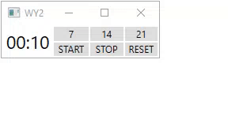

# Watch Yourself 2 (WY2)
Simple timer (.NET, C#, WPF)

### General Information
I use a timer in my job. Concentrating on the task I hardly move for several hours. It's easy way to treat back pain, burning eyes,... In the timer, I can set a time interval after which I will be informed. Then I act.

I made my first timer in [Python](https://github.com/SOS-RB1/Watch-Yourself). The second similar [(WY2)](https://github.com/SOS-RB1/Watch-Yourself-2-WY2-/blob/main/WY2_app_pack.zip) I wanted to do in a different technology to see a difference while creating and learn new things.

### Technologies Used
* .NET 6
* C# 10
* WPF

